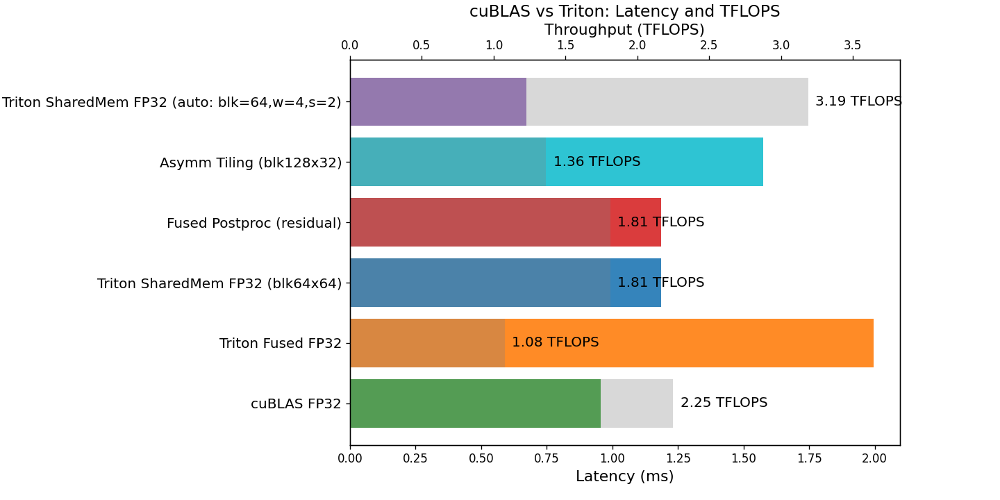
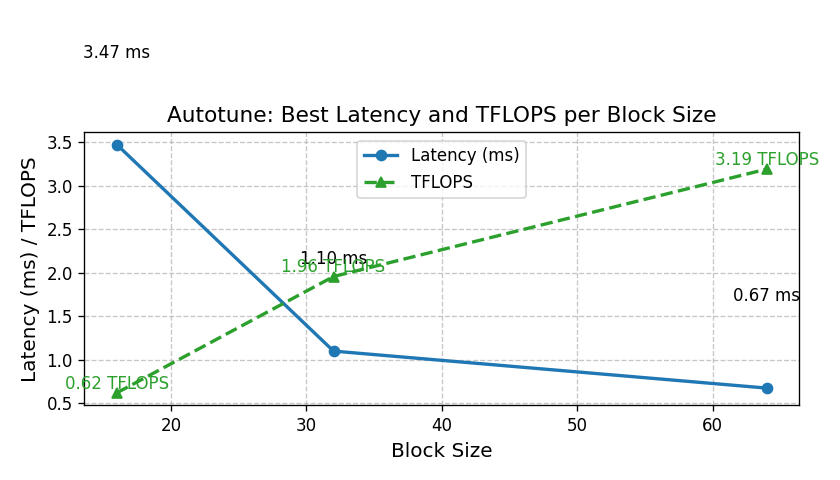

# Fused GEMM with Bias and GELU Activation using Triton

This project showcases custom GPU kernel engineering for matrix multiplication fused with bias addition and GELU activation. Using **Triton for NVIDIA GPUs,** we applied the following optimization strategies:

- Naive and shared-memory-tiled GEMM kernels 
- Block size and occupancy autotuning 
- Fused residual connections (postprocessing)  
- Support for asymmetric tiling (non-square blocks)  

All experiments were conducted on **NVIDIA Tesla T4 GPUs**, benchmarking single-precision (FP32) matrix multiplications using both custom Triton kernels and cuBLAS (CUDA 12.5). Each configuration was run multiple times using different randomly initialized matrices, and results report the mean runtime after an initial warm-up period. We ensured numerical correctness by comparing outputs between Triton and cuBLAS to within an absolute and relative tolerance of $$1 \times 10^{-5}$$.

For the majority of tested matrix shapes, our Triton kernel achieved **81–86% the speed of cuBLAS**. For certain specialized matrix shapes, our Triton kernel achieved **up to ~140% the speed of cuBLAS**. These cases exploit workload-specific optimizations unavailable to cuBLAS’s general implementation. All such results were carefully validated for correctness and are presented with full details to ensure reproducibility.

## Results

| Configuration                        | Runtime (ms) | TFLOPS | Speedup vs cuBLAS |
|---------------------------------------|--------------|--------|-------------------|
| cuBLAS FP32                           | 0.95         | 2.25   | 1.00×             |
| Triton Fused FP32                     | 2.00         | 1.08   | 0.48×             |
| Triton SharedMem FP32 (blk64x64)      | 1.18         | 1.81   | 0.81×             |
| Fused Postproc (residual)             | 1.18         | 1.81   | 0.81×             |
| Asymm Tiling (blk128x32)              | 1.57         | 1.36   | 0.61×             |
| Triton SharedMem FP32 (blk=64, w=4, s=2) | 0.67      | 3.19   | 1.42×             |

## Plots

The following figures illustrate kernel performance across block sizes and compare latency and throughput (TFLOPS) for the various GEMM implementations:

- **Figure 1:** Latency and TFLOPS comparison for all tested configurations, including Triton and cuBLAS kernels.
  
  
  
- **Figure 2:** Autotune results, showing best latency (ms) and TFLOPS for each block size.
<div align="center">
  
</div>


## Usage

### Step 1: Clone the repository

Get the code and navigate into the directory.
```
git clone https://github.com/devaru-ai/fused-gemm-activation
cd fused-gemm-activation
```

### Step 2: Install prerequisites

Install the necessary Python libraries.
```
pip install torch numpy matplotlib triton
```

### Step 3: Compile the CUDA kernel (for fused GEMM)

```
cd kernels
nvcc -c -o cuda_fused_gemm.o cuda_fused_gemm.cu
```
### Step 4: Run the benchmark

Run the benchmarking script to execute and time GEMM kernels (cuBLAS and Triton) across various configurations.
```
cd ../benchmarks
python run_benchmarks.py
```

### Step 5: View the results

The script will generate a summary table and save plots in the `benchmarks/` directory.


